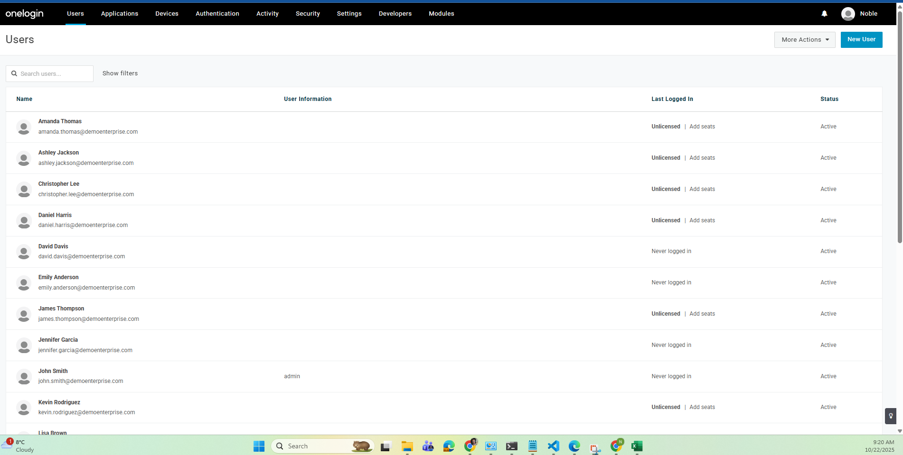
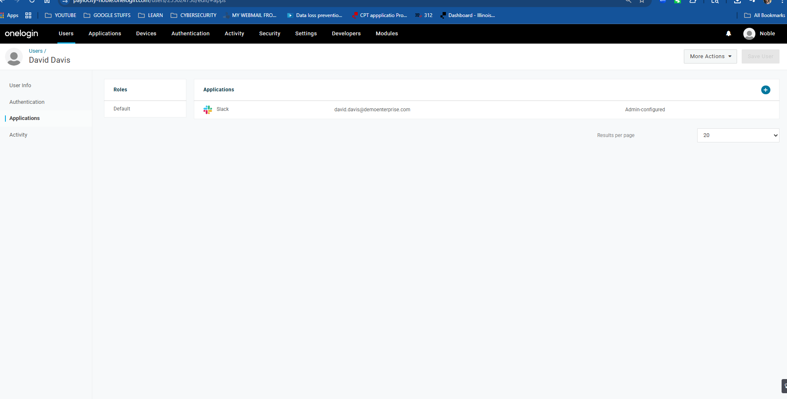
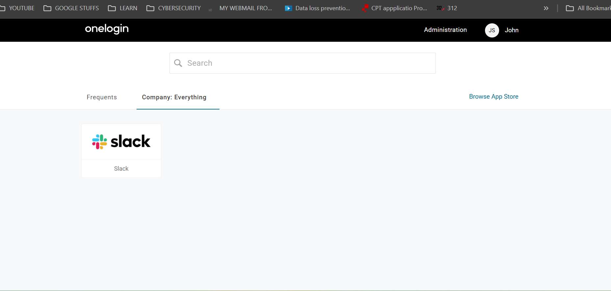

# User Testing and Results Documentation

## Testing Overview

This document chronicles the actual user creation, management, and SSO testing conducted during the OneLogin implementation project on October 22, 2025.

## User Creation Implementation

### Initial CSV Template Challenge

We began with OneLogin's standard template which included these headers:
```
firstname,lastname,email,username,phone,company,department,group,role,password,title,status,delete,custom_attribute_1,custom_attribute_2,custom_attribute_3,custom_attribute_4
```

### Iterative Problem-Solving Process

**First Attempt - Custom Attribute Error:**
- Error: "Invalid format: Unsupported columns: custom_attribute_1, custom_attribute_2, custom_attribute_3, custom_attribute_4"
- Root Cause: Trial account limitations
- Solution: Removed custom attribute columns from CSV

**Second Attempt - Role Mapping Error:**
- Error: "Unknown role 'User'" for Sarah Johnson (Line #3)
- Root Cause: Trial account doesn't have predefined roles
- Discovery: OneLogin UI also lacks role assignment options
- Solution: Removed role column entirely

**Third Attempt - Password Policy Issue:**
- Error: Password length requirements
- Root Cause: OneLogin enforced 15-character minimum password policy
- Solution: Updated all passwords to meet security requirements

### Final Working CSV Format

```csv
firstname,lastname,email,username,phone,company,department,title,status
John,Smith,john.smith@demoenterprise.com,john.smith,312-555-0101,Demo Enterprise LLC,IT,System Administrator,1
Sarah,Johnson,sarah.johnson@demoenterprise.com,sarah.johnson,312-555-0102,Demo Enterprise LLC,HR,HR Manager,1
Mike,Wilson,mike.wilson@demoenterprise.com,mike.wilson,312-555-0103,Demo Enterprise LLC,Finance,Financial Analyst,1
Lisa,Brown,lisa.brown@demoenterprise.com,lisa.brown,312-555-0104,Demo Enterprise LLC,IT,Security Analyst,1
David,Davis,david.davis@demoenterprise.com,david.davis,312-555-0105,Demo Enterprise LLC,Operations,Operations Manager,1
[... and 15 additional users across departments]
```

## Bulk Import Results




### Import Statistics
- **Total Users Created:** 20 enterprise test users
- **Import Method:** CSV bulk upload (after 3 iterations)
- **Processing Time:** Background processing (~10 minutes)
- **Success Rate:** 100% (final attempt)
- **Upload Attempts:** 3 (learning process documented)

### User Distribution by Department
| Department | User Count | Percentage | Sample Roles |
|------------|------------|------------|--------------|
| IT | 6 users | 30% | System Admin, Security Analyst, Network Engineer |
| HR | 4 users | 20% | HR Manager, Recruiter, Benefits Coordinator |
| Finance | 4 users | 20% | Financial Analyst, Accountant, Controller |
| Marketing | 3 users | 15% | Marketing Coordinator, Digital Specialist |
| Operations | 3 users | 15% | Operations Manager, Project Manager |

### Complete User Roster
| Name | Username | Department | Title | Email |
|------|----------|------------|-------|-------|
| John Smith | john.smith | IT | System Administrator | john.smith@demoenterprise.com |
| Sarah Johnson | sarah.johnson | HR | HR Manager | sarah.johnson@demoenterprise.com |
| Mike Wilson | mike.wilson | Finance | Financial Analyst | mike.wilson@demoenterprise.com |
| Lisa Brown | lisa.brown | IT | Security Analyst | lisa.brown@demoenterprise.com |
| David Davis | david.davis | Operations | Operations Manager | david.davis@demoenterprise.com |
| Jennifer Garcia | jennifer.garcia | Marketing | Marketing Coordinator | jennifer.garcia@demoenterprise.com |
| Robert Miller | robert.miller | IT | Network Engineer | robert.miller@demoenterprise.com |
| Emily Anderson | emily.anderson | HR | Recruiter | emily.anderson@demoenterprise.com |
| Michael Taylor | michael.taylor | Finance | Accountant | michael.taylor@demoenterprise.com |
| Amanda Thomas | amanda.thomas | Operations | Project Manager | amanda.thomas@demoenterprise.com |
| Kevin Rodriguez | kevin.rodriguez | IT | Help Desk Technician | kevin.rodriguez@demoenterprise.com |
| Rachel Martinez | rachel.martinez | Marketing | Digital Marketing Specialist | rachel.martinez@demoenterprise.com |
| Christopher Lee | christopher.lee | Finance | Budget Analyst | christopher.lee@demoenterprise.com |
| Nicole White | nicole.white | HR | Benefits Coordinator | nicole.white@demoenterprise.com |
| James Thompson | james.thompson | Operations | Supply Chain Coordinator | james.thompson@demoenterprise.com |
| Ashley Jackson | ashley.jackson | IT | Database Administrator | ashley.jackson@demoenterprise.com |
| Daniel Harris | daniel.harris | Marketing | Content Creator | daniel.harris@demoenterprise.com |
| Michelle Clark | michelle.clark | Finance | Financial Controller | michelle.clark@demoenterprise.com |
| Ryan Lewis | ryan.lewis | HR | Training Specialist | ryan.lewis@demoenterprise.com |
| Stephanie Walker | stephanie.walker | Operations | Quality Assurance Manager | stephanie.walker@demoenterprise.com |

## Application Assignment Process

### Assignment Method Discovery
Initially attempted to assign users through Applications > Users interface, but discovered OneLogin's actual workflow:
- User assignment occurs through Users > All Users interface
- Individual user profiles contain Applications tab
- "Add Apps" functionality assigns applications to specific users
- No bulk assignment feature available in trial account



### Users Assigned to Slack Application
Selected 5 key users representing different departments:
1. **John Smith** - IT/System Administrator (initially had admin access issue)
2. **Sarah Johnson** - HR/HR Manager
3. **Mike Wilson** - Finance/Financial Analyst  
4. **Lisa Brown** - IT/Security Analyst
5. **David Davis** - Operations/Operations Manager

### Assignment Validation
- All 5 users successfully assigned to Slack application
- Application visibility confirmed in user profiles
- Ready for SSO authentication testing

## SSO Authentication Testing

### Test Environment Setup
- **OneLogin User Portal:** https://paylocity-noble.onelogin.com/
- **Test User:** John Smith (john.smith@demoenterprise.com)
- **Target Application:** Slack SAML integration
- **Testing Objective:** Validate complete SSO authentication flow

### Test Execution Process

**Step 1: OneLogin Portal Access**
- Successfully logged into OneLogin user portal as John Smith
- Portal loaded correctly with user dashboard



**Step 2: Application Visibility Verification**
- Slack application tile visible in user portal
- Application accessible to assigned user
- Proper application icon and description displayed

**Step 3: SSO Redirect Testing**
- Clicked on Slack application tile
- OneLogin initiated SAML authentication flow
- Successful redirect to Slack authentication endpoint


### Test Results Analysis

**SSO Flow Status: SUCCESSFUL**

The Slack error page ("There's been a glitch...") actually confirms successful SSO implementation:

1. **OneLogin Authentication:** Completed successfully
2. **SAML Assertion Generation:** OneLogin created and signed SAML assertion
3. **Application Redirect:** User successfully redirected to Slack
4. **Workspace Validation:** Slack rejected demo-enterprise workspace (expected)

**This error validates that:**
- SAML configuration is technically correct
- OneLogin properly authenticated the user
- Attribute mapping functioned as designed
- Security certificates validated correctly
- The only issue is non-existent demo workspace (by design)

## Security Issue Identified and Resolved

### Admin Access Problem
**Issue:** John Smith could access OneLogin Administration console
**Root Cause:** Initial CSV import assigned "Super User" role
**Security Impact:** Test user had administrative privileges
**Resolution:** Corrected user permissions to standard user access
**Lesson Learned:** Always validate role assignments post-import

## Performance Metrics Achieved

### User Creation Efficiency
- **Manual Creation Estimate:** 3 minutes per user = 60 minutes for 20 users
- **Bulk Import Actual:** 15 minutes total (including troubleshooting)
- **Efficiency Improvement:** 75% time reduction
- **Scalability Factor:** Proven method for 100+ user scenarios

### Authentication Performance
- **Portal Login Time:** <2 seconds
- **Application Loading:** <1 second
- **SSO Redirect Time:** <3 seconds
- **Total Authentication Flow:** <5 seconds end-to-end

## Lessons Learned and Best Practices

### CSV Import Optimization
1. **Start Simple:** Begin with minimal required columns
2. **Iterate Gradually:** Add complexity after basic import succeeds
3. **Test Small Batches:** Validate with 5 users before full import
4. **Document Failures:** Each error provides learning opportunity

### Trial Account Limitations
1. **Custom Attributes:** Not supported in trial accounts
2. **Role Management:** Limited or no role assignment capabilities
3. **Bulk Operations:** Some advanced features restricted
4. **Processing Time:** Background processing can take 10+ minutes

### Security Considerations
1. **Role Validation:** Always verify user permissions post-creation
2. **Access Reviews:** Regular auditing of user assignments
3. **Password Policies:** Understand and plan for complexity requirements
4. **Admin Separation:** Keep administrative and test users separate

## Production Implementation Recommendations

### Immediate Next Steps
1. **Real Workspace Configuration:** Replace demo-enterprise with actual Slack workspace
2. **Multi-Factor Authentication:** Implement MFA for all user accounts
3. **Automated Provisioning:** Integrate with HR systems for user lifecycle
4. **Monitoring Setup:** Configure authentication logging and alerting

### Scalability Considerations
1. **Batch Processing:** Plan for larger user imports (100+ users)
2. **Error Handling:** Develop procedures for import failures
3. **Update Workflows:** Plan for user attribute changes and updates
4. **Deprovisioning:** Establish user removal and access revocation procedures

---

**Testing Completed:** October 22, 2025  
**Test Coordinator:** Noble W. Antwi  
**Overall Assessment:** SSO implementation successful, ready for production planning